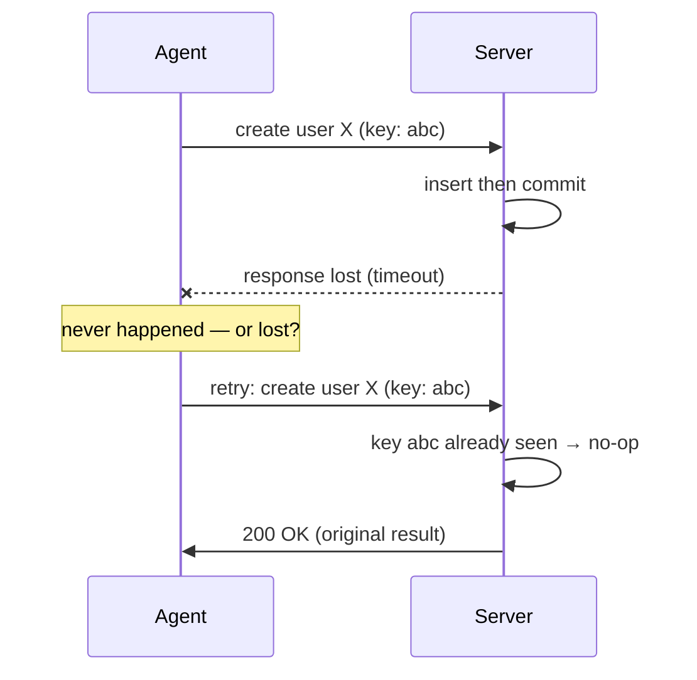

# Idempotency

> Make an operation safe to run again and safe to interrupt. Running it twice should be indistinguishable from running it once.

## Principle

An operation is *idempotent* when running it twice has the same effect as running it once. A process
is *disposable* when it can be killed mid-run and restarted without corrupting state or losing work.
Two goals, one discipline: make **repetition harmless** and **interruption recoverable**.

Both rest on durable state as the source of truth. Statelessness — no hidden in-process state between
calls — is what makes a process disposable: kill it and a fresh instance resumes from durable state.
But statelessness alone doesn't make an operation safe to repeat; a stateless "append a row" still
doubles on retry. Idempotency needs a deliberate mechanism on top: converge on a target state, or
deduplicate against a durable key, with atomic writes so an interrupted run leaves nothing half-applied.

The move is to make the *result* depend on the inputs and the target's current state — not on how many
times it ran. "Create user X" run twice should converge to one user X, not two and not an error: an
upsert, a natural idempotency key, or an insert that on a uniqueness conflict confirms the existing
record is *this* request before reporting success (a conflict can also mean a different request claimed
that key).

## Why it matters for agentic development

Agents retry by default. They hit timeouts and partial failures, and their recovery is to run it again
— often without knowing whether the first attempt landed. A non-idempotent operation turns each retry
into a second side effect: a duplicate charge, a doubled message, a corrupted counter.

- **Retries are the norm.** A tool call times out and the agent re-issues it. If the first already
  succeeded server-side, the operation has now run twice — the agent feels no "wait, did that land?"
- **Partial failure is invisible.** With no response, an agent can't tell "never happened" from
  "happened, response lost." Only an idempotent operation makes retrying safe.
- **Interruption is routine.** Runs get cancelled and processes restart mid-task. Work that can't
  resume from a partial state is lost or corrupted.
- **Volume multiplies it.** An edge a human hits once and notices, an agent hits hundreds of times, silently.

## How to apply

A request lands, its response is lost, and the agent retries — an idempotency key makes the second attempt a no-op that returns the original result rather than a second side effect:

- **Converge to a state; don't blindly apply a delta.** Prefer `set quantity = 5` over `add 1`, upsert
  over insert. Where you must accumulate, recompute from an append-only ledger of keyed entries so a replay is a no-op.
- **Use idempotency keys for unavoidable side effects.** When the action really creates something
  external (a payment, an email), let the caller pass a key you deduplicate on, so a retry returns the
  original result.
- **Keep operations stateless.** Hold no required state in memory between calls; derive everything from
  inputs and durable storage.
- **Design for interruption.** Assume the process can die anywhere. Use transactions or atomic writes so
  a partial run leaves no half-applied state, and checkpoint long work so it resumes instead of restarting.
- **Make retry the safe default.** A tool should be retryable without the caller remembering whether it
  already ran — the safety lives in the operation, not the caller's memory.

| Non-idempotent | Idempotent |
|---|---|
| `INSERT` | `UPSERT` to a target value (not `+= 1`) / insert-then-confirm-on-conflict |
| `add 1` to a counter | `set quantity = 5` (converge to target) |
| accumulate in place | replay an append-only keyed ledger |
| send email / charge card | same action gated by a caller idempotency key |

## Trade-offs

Idempotency isn't free — keys, dedup storage, and recompute-from-a-ledger all cost something, and for
a cheap, already-safe repeat they can be overkill. And some operations genuinely can't be made
idempotent. Where one truly can't, name it and put [anti-foot-gun](anti-foot-gun.md) guardrails on it
(explicit opt-in, confirmation) so a reflexive retry can't reach it — the guardrail substitutes for the
property you can't get.

## Litmus test

> Kill the process mid-run and run it again — is the end state indistinguishable from running it
> exactly once?

## Related

- [Anti-Foot-Gun](anti-foot-gun.md) — guardrails on the non-idempotent core when convergence isn't possible.
- [Least Privilege](least-privilege.md) — cap the blast radius of a retry that does fire, not just whether it's safe.
- [Determinism](determinism.md) — the sibling on a different axis: safe *repetition of a side effect* here, reproducibility of a *result* there.
- [Single Source of Truth](single-source-of-truth.md) — Idempotency leans on durable state as the truth so one operation converges; SSOT applies that instinct to every *fact*, not one operation.

## References

- [The Twelve-Factor App](https://12factor.net/) — factors VI (stateless processes) and IX (disposability)
- [Stripe: Idempotent Requests](https://docs.stripe.com/api/idempotent_requests)
